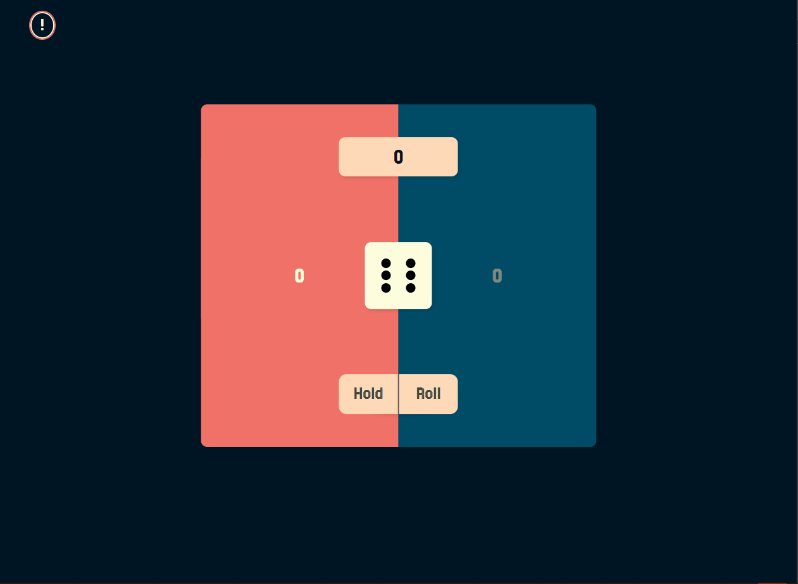
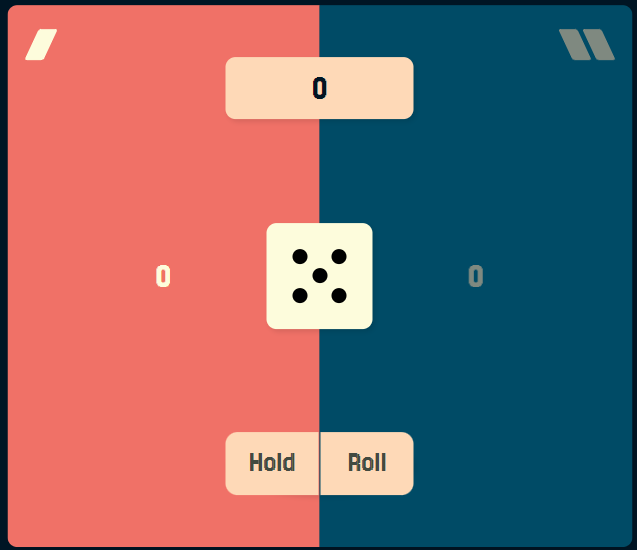
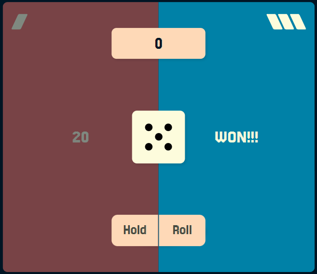
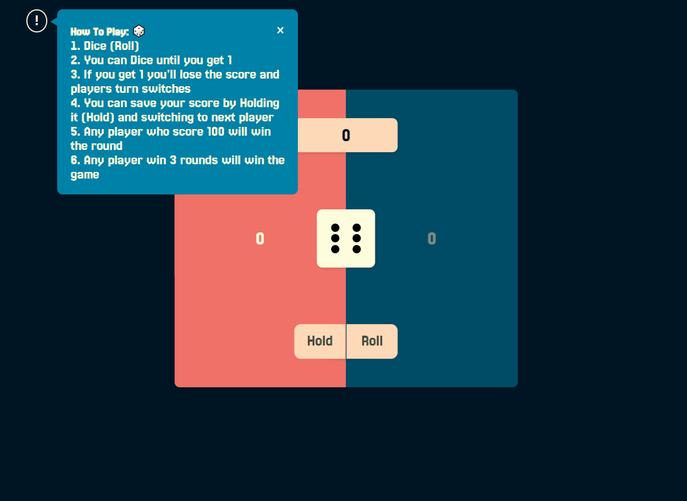
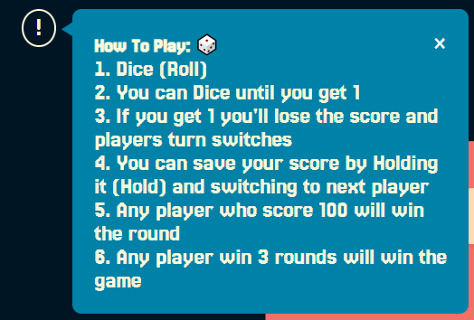

# Dicer: A Modern Take on the Classic Pig Game
Welcome to Dicer!
Dicer is a single-player pig game with a twist! I built it as my first project on my Front-End 
development journey. While adhering to the core gameplay, I've introduced unique features to enhance 
the experience.

## Overview:
- Dicer pits you against the computer in a race to 100 points across three rounds.
- On your turn, you can either:
  - Roll the Dice: Take a chance and add the roll's value to your current score.
  - Hold: Secure your points and pass the turn to the computer.
However, beware! Rolling a 1 will reset your turn score to 0.
The first player to reach 100 points after three rounds wins the game!

- Overview:

- Rounds won for each player:

- Final Winner:

- A simple guide for HowToPlay:

## Tools and Technologies:
I learned alot building this project, using a lot of tools and also building my own style library for
performance and efficiency.

## Tech Stack and Learning Curve:
Building Dicer was a rewarding learning experience, and I leveraged several essential tools:
1. Git/GitHub: Version control for collaboration and project management.
2. npm: Dependency management to install and manage project libraries.
3. Webpack: A robust build tool for code bundling, optimization, and transformation.
4. Babel: Enables compatibility across different browsers by transpiling modern JavaScript.
5. Modular Architecture: Organized code structure for better maintainability and scalability.

## Next Steps:
This project is currently under development to add two-player functionality.
I'm constantly learning and improving my skills. Feel free to reach out to discuss (Linkedin) Dicer or my development journey!
